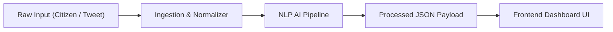
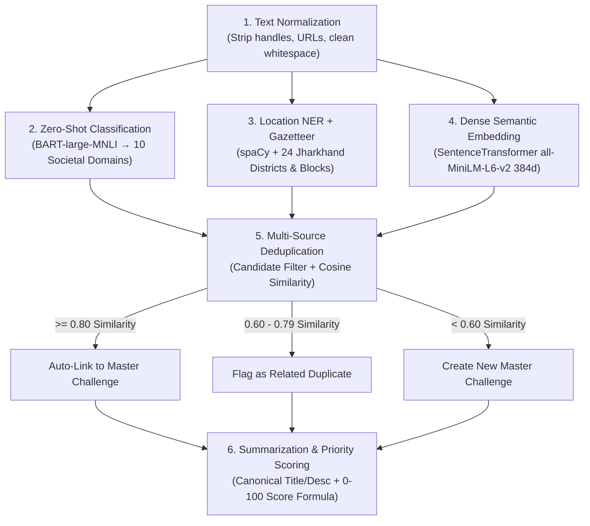

# NLP Pipeline: Ingestion-to-Dashboard Integration Guide
**Module:** AI Pipeline $\leftrightarrow$ Frontend Dashboard Bridge  
**Target Audience:** Frontend Developers building the Government / Admin / University Dashboards  
**Status:** Active & Verified

---

## 1. Executive Summary & Purpose

This guide defines the exact **contract between the AI/NLP Pipeline and the Frontend Dashboard**.

When raw, noisy civic signals arrive from **Citizen Forms** or **Twitter/X Posts**, the NLP pipeline cleans, classifies, geolocates, deduplicates, and scores the issue. It produces a structured **Frontend-Ready JSON Object** that the dashboard developer can plug directly into UI components (Challenge Cards, Map Pins, Evidence Streams, and AI Inspection Panels).



---

## 2. Input Contract (What the Pipeline Receives)

The ingestion layer receives raw complaints and normalizes them into the following standard dictionary:

```json
{
  "source": "citizen",
  "raw_text": "Primary Health Center in Namkum, Ranchi has no doctor on duty and acute shortage of antivenom and emergency medicines for 2 months.",
  "submitted_lat": 23.3441,
  "submitted_lng": 85.3096,
  "author": "Citizen_Ranchi_01",
  "metadata": {
    "channel": "web_form",
    "district_hint": "Ranchi"
  }
}
```

### Input Field Descriptions:
| Field | Type | Required? | Description |
|---|---|---|---|
| `source` | `string` | **Yes** | `"citizen"` or `"twitter"` or `"news"` |
| `raw_text` | `string` | **Yes** | The raw grievance text with hashtags, mentions, or informal syntax |
| `submitted_lat` | `float \| null` | Optional | GPS latitude if user provided geolocation |
| `submitted_lng` | `float \| null` | Optional | GPS longitude if user provided geolocation |
| `author` | `string` | Optional | User identifier or Twitter screen name |
| `metadata` | `object` | Optional | Contextual tags (e.g. `district_hint`, `channel`) |

---

## 3. How the Pipeline Processes the Data (The 6 Stages)



1. **Text Normalization (`ingestion/normaliser.py`)**: Removes URLs, noise, cleans whitespace.
2. **Domain Classification (`pipeline/classification.py`)**: Zero-shot classifier (`BART-large-MNLI`) assigns one of 10 domains (e.g. *Healthcare, Water & Sanitation, Education, Infrastructure*) and a specific subdomain (*PHC Staffing*).
3. **Location NER + Gazetteer (`pipeline/location_extraction.py`)**: Extracts Jharkhand district and block using spaCy and a 24-district gazetteer.
4. **Embeddings (`pipeline/embeddings.py`)**: Generates a 384-dimensional dense vector for semantic similarity matching.
5. **Deduplication (`pipeline/deduplication.py`)**:
   - $\ge 0.80$: Merges into existing Master Challenge.
   - $0.60 - 0.79$: Flags as related/potential duplicate for government review.
   - $< 0.60$: Creates a new Master Challenge.
6. **Canonical Summarization & Priority Scoring (`pipeline/priority_scoring.py`, `summarization.py`)**:
   - Generates a concise title and description.
   - Computes a $0-100$ Priority Score based on: **Domain Severity (40%) + Evidence Volume (20%) + Velocity/Trend (20%) + Confidence (20%)**.

---

## 4. Output Contract (The Exact JSON for the Frontend)

This is the exact JSON structure returned by the pipeline and saved to the database:

```json
{
  "_meta": {
    "processing_time_ms": 412.5,
    "pipeline_action": "new_challenge",
    "processed_at": "2026-09-10T06:56:03.614Z"
  },
  "challenge": {
    "id": "HC-9c0ee0fb",
    "title": "Healthcare Issue in Namkum Ranchi",
    "description": "Primary Health Center in Namkum, Ranchi has no doctor on duty and acute shortage of antivenom and emergency medicines for 2 months.",
    "domain": "Healthcare",
    "subdomain": "PHC Staffing",
    "status": "pending_verification",
    "priority_score": 75,
    "location": "Namkum Ranchi",
    "district": "Ranchi",
    "block": "Namkum",
    "lat": 23.3441,
    "lng": 85.3096,
    "verified": false,
    "complaint_count": 2,
    "trend": "increasing",
    "created_at": "2026-09-10T06:56:02.890Z"
  },
  "ai_analysis": {
    "domain_classification": {
      "top_domain": "Healthcare",
      "subdomain": "PHC Staffing",
      "domain_scores": {
        "Healthcare": 0.758,
        "Rural Livelihoods": 0.087,
        "Accessibility": 0.064,
        "Energy": 0.025,
        "Public Administration": 0.019,
        "Urban Development": 0.012,
        "Environment": 0.012,
        "Infrastructure/Transport": 0.009,
        "Education": 0.008,
        "Water & Sanitation": 0.007
      }
    },
    "priority_breakdown": {
      "score": 75,
      "factors": {
        "severity": 0.90,
        "evidence_volume": 0.02,
        "confidence": 0.80,
        "trend": 1.00
      },
      "explanation": "Priority 75/100: Domain severity (Healthcare) is 0.90. Backed by 2 evidence items (confidence 0.80). Report trend is increasing."
    },
    "deduplication": {
      "action_taken": "new_challenge",
      "matched_challenge_id": null,
      "related_challenges": [
        {
          "target_id": "HC-12345678",
          "similarity_score": 0.68
        }
      ]
    }
  },
  "evidences": [
    {
      "id": "EV-713631c7",
      "source": "citizen",
      "clean_text": "Primary Health Center in Namkum, Ranchi has no doctor on duty and acute shortage of antivenom and emergency medicines for 2 months.",
      "raw_text": "Primary Health Center in Namkum, Ranchi has no doctor on duty and acute shortage of antivenom and emergency medicines for 2 months.",
      "submitted_lat": 23.3441,
      "submitted_lng": 85.3096,
      "created_at": "2026-09-10T06:56:02.893Z"
    },
    {
      "id": "EV-824742d8",
      "source": "twitter",
      "clean_text": "Namkum PHC clinic closed without doctors or medicines. Urgent intervention needed in Ranchi!",
      "raw_text": "@JharkhandGovt Namkum PHC clinic closed without doctors or medicines. Urgent intervention needed in Ranchi! #NamkumHealth",
      "submitted_lat": null,
      "submitted_lng": null,
      "created_at": "2026-09-10T06:57:12.110Z"
    }
  ]
}
```

---

## 5. UI Component Mapping Guide (Where to Render What)

Here is how each key maps to specific UI components on the dashboard:

| Dashboard UI Element | JSON Key Path | Display Format / Behavior |
|---|---|---|
| **Challenge Card Title** | `challenge.title` | Text heading |
| **Problem Description** | `challenge.description` | Text paragraph |
| **Domain Tag / Badge** | `challenge.domain` + `challenge.subdomain` | Colored Pill (e.g. `[Healthcare • PHC Staffing]`) |
| **Priority Badge** | `challenge.priority_score` | 🔴 **Critical** ($\ge 85$), 🟠 **High** ($70-84$), 🟡 **Medium** ($50-69$), 🟢 **Low** ($<50$) |
| **Location / Geo Pin** | `challenge.district`, `challenge.block`, `challenge.lat`, `challenge.lng` | District/Block badge + Pin on Leaflet/Mapbox Map |
| **Status Tag** | `challenge.status` | `pending_verification`, `verified`, `routed`, `in_progress` |
| **Corroborating Evidence Counter** | `challenge.complaint_count` | e.g. `2 Corroborating Signals (1 Citizen, 1 Tweet)` |
| **Velocity / Trend Indicator** | `challenge.trend` | 📈 Increasing, ➡️ Stable, 📉 Decreasing |
| **AI Explainability Accordion** | `ai_analysis.priority_breakdown.explanation` | Text breakdown explaining *why* the priority score was assigned |
| **AI Confidence Radar / Bar Chart** | `ai_analysis.domain_classification.domain_scores` | Bar chart / progress bars of top classification probabilities |
| **Multi-Source Evidence Timeline** | `evidences[]` | Chronological feed showing raw tweet vs citizen report with source badges |
| **Duplicate / Related Alert** | `ai_analysis.deduplication.related_challenges` | Alert box: *"Possible related challenge HC-12345678 (68% similarity) - [Review Relation]"* |

---

## 6. Frontend TypeScript Interfaces

Frontend developers can paste these TypeScript interfaces into `src/types/challenge.ts`:

```typescript
export interface EvidenceItem {
  id: string;
  source: 'citizen' | 'twitter' | 'news';
  clean_text: string;
  raw_text: string;
  submitted_lat: number | null;
  submitted_lng: number | null;
  created_at: string;
}

export interface RelatedChallenge {
  target_id: string;
  similarity_score: number;
}

export interface AIAnalysis {
  domain_classification: {
    top_domain: string;
    subdomain: string | null;
    domain_scores: Record<string, number>;
  };
  priority_breakdown: {
    score: number;
    factors: {
      severity: number;
      evidence_volume: number;
      confidence: number;
      trend: number;
    };
    explanation: string;
  };
  deduplication: {
    action_taken: 'link' | 'flag_related' | 'new_challenge';
    matched_challenge_id: string | null;
    related_challenges: RelatedChallenge[];
  };
}

export interface ProcessedChallengePayload {
  _meta: {
    processing_time_ms: number;
    pipeline_action: string;
    processed_at: string;
  };
  challenge: {
    id: string;
    title: string;
    description: string;
    domain: string;
    subdomain: string | null;
    status: string;
    priority_score: number;
    location: string;
    district: string | null;
    block: string | null;
    lat: number | null;
    lng: number | null;
    verified: boolean;
    complaint_count: number;
    trend: string;
    created_at: string;
  };
  ai_analysis: AIAnalysis;
  evidences: EvidenceItem[];
}
```

---

## 7. How the Frontend Dev Can Test with Mock Data

1. Run the test processor to generate real output:
   ```powershell
   cd backend
   python test_mock_processor.py --output frontend_mock_output.json
   ```
2. The file `backend/frontend_mock_output.json` will be generated immediately with fresh AI data.
3. Import `frontend_mock_output.json` into your React mock state or API stub to build and verify your UI components offline.
